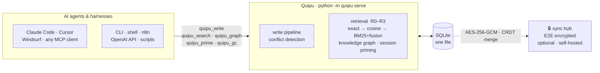

<div align="center">


### Persistent memory for AI agents and assistants.

Local-first · single-file · zero-infra · no cloud

[](LICENSE)
[](https://www.python.org/)
[](https://pypi.org/project/quipu-mcp/)
[](https://modelcontextprotocol.io/)
[](https://github.com/ajadi/quipu/actions/workflows/ci.yml)
[](#status)



**Works with:** Claude Code · Cursor · Windsurf · any MCP client · OpenAI function calling · n8n · shell scripts

</div>

---

## The problem

- **AI assistants forget between sessions.** Every new window, `/clear`, or agent restart throws away context you built — decisions, trade-offs, gotchas — and you re-explain them from scratch. Affects Claude, ChatGPT, Cursor, and any other AI tool you use.
- **Cloud memory pulls your context off-machine and costs money.** mem0 & co. ship your project history to someone else's servers and meter it.
- **Self-hosted memory means heavy infra.** Qdrant + Neo4j + Docker is a lot of moving parts just to remember what you decided yesterday. You shouldn't need a distributed system to persist a thought.

**Quipu solves it with one SQLite file on your machine.**

---

## Why Quipu

|                                       | **Quipu** | mem0 (cloud) | OpenMemory | Self-hosted stack |
|---------------------------------------|:---------:|:------------:|:----------:|:-----------------:|
| Runs fully local (no cloud)           | ✅        | ❌           | ⚠️ partial | ✅                |
| No heavy infra (no Docker/Qdrant/Neo4j) | ✅      | ✅           | ❌         | ❌                |
| Single-file store (SQLite)            | ✅        | ❌           | ❌         | ❌                |
| MCP-native                            | ✅        | ⚠️           | ⚠️         | ⚠️                |
| Zero-knowledge E2E sync               | ✅        | ❌           | ❌         | ❌                |
| Autonomous session priming            | ✅        | ❌           | ❌         | ❌                |

Quipu is the only one that is **local, single-file, MCP-native, zero-infra, and privately synced** at the same time.

**10 MCP tools • 925 tests • MIT licensed • Python 3.10+**

> ¹ mem0 "no heavy infra" = managed SaaS — you run nothing, but your context goes to their cloud.

---

**Claude Code, Cursor, Windsurf, or any MCP client?** Just tell your AI: *"set up Quipu for me"* — it can run the installer and wire up the `.mcp.json` entry for you.

---

## 60-second quickstart

**1. Install** (creates a dedicated venv at `~/.quipu/venv` and fetches the default embedding model — no Hugging Face login required):

```sh
git clone https://github.com/ajadi/quipu && cd quipu
./install.sh
```

**2. Connect to your MCP client.** Add one entry to your project's `.mcp.json`
(replace `<your-project-root>` with the absolute path to your project):

```json
{
  "mcpServers": {
    "quipu": {
      "command": "~/.quipu/venv/bin/python",
      "args": ["-m", "quipu", "serve"],
      "env": {
        "QUIPU_MODE": "project",
        "QUIPU_PROJECT_ROOT": "<your-project-root>"
      }
    }
  }
}
```

**3. Verify.** Restart your MCP client and ask it to write and recall a memory — the
`quipu_write`, `quipu_search`, and `quipu_list` tools appear in the MCP tool list.

> `quipu init` prints the exact `.mcp.json` snippet for your platform, including
> the absolute Python path. See [Reference](#reference) for details.

---

## How it works



Your AI agent or assistant writes **atoms** (decisions, observations, questions, retrospectives) into a
single local SQLite file. On recall, Quipu ranks them with multi-tier retrieval
(FTS5 BM25 + on-device cosine fusion) and serves them straight back over MCP.

- **All local.** Memory lives in one SQLite file on your machine — nothing leaves it.
- **On-device embeddings.** Selectable local embedding model (default: `nomic-embed-v2`) runs via ONNX; no embedding API calls.
- **Private by design.** Cross-machine sync is end-to-end encrypted — the relay sees only ciphertext. Your memories never leave your control in plaintext.

---

## Status

**✅ Works today (Phase 1–4)**
- Local-first MCP memory server (`python -m quipu serve`) with **10 MCP tools**: write, search, get, list, invalidate, flush, stats, push, pull, prime, receipts
- On-device embeddings via ONNX (default: `nomic-embed-v2`, selectable via `QUIPU_EMBEDDING_MODEL`; no network)
- Single-file SQLite store, `project` and `global` modes
- Multi-tier retrieval R0–R3 (exact, cosine, FTS5 BM25, fusion) with access-count boosting
- Conflict detection on write — surfaces near-duplicate/contradicting memories (cosine similarity) so the caller adjudicates (supersede via `quipu_invalidate` or keep both), instead of silently invalidating
- Transparent `sqlite-vec` auto-upgrade for large stores (graceful fallback to pure-Python cosine)
- Universal native-hook capture loop with durable spool + `quipu drain`
- CLI: `init` / `serve` / `mirror` / `drain` / `backfill` / `receipts` / `gc`
- Capture memory from Forge workflows (optional adapter)
- **Encrypted, zero-knowledge cross-machine sync** via a self-hostable hub — your memories never leave your control in plaintext
- Oplog backfill — retroactively sync memories written before sync was enabled (`quipu backfill`)
- **Knowledge graph** — typed edges between atoms; `graph_expand` parameter in `quipu_search` for relationship-aware retrieval
- **Session tracking** — `session_id` on every atom; filter recalls by session in `quipu_search`
- **Autonomous session priming** — `quipu_prime` surfaces the most relevant prior memories at session start (never raises; best-effort)
- **Explicit sync tools** — `quipu_push` and `quipu_pull` for on-demand hub sync (offline-safe)
- **Privacy-safe audit** — `quipu receipts` CLI and `quipu_receipts` MCP tool export hashed/redacted oplog
- **Garbage collection** — `quipu gc` prunes stale, low-access atoms (`--dry-run` safe)

**📋 Planned**
- Hosted zero-knowledge sync hub (managed option)
- Memory kinds, provenance, confidence scores, temporal validity
- Branching and contradiction events
- Decay / forget policies

> Actively developed — **star to follow.**

---

## Reference

<details>
<summary><strong>CLI commands</strong></summary>

```
quipu [--version]
  init [--mode {project,global,server}]   # initialise store + write config.json
  serve                                    # start the MCP server over stdio
  mirror --project-id <id> [--output-dir memory] [--db-path PATH]
  drain [--queue-path PATH] [--db-path PATH] [--project-id ID]
  backfill [--db-path PATH] [--project-id ID]
  receipts [--db-path PATH] [--project-id ID] [--limit N] [--format json|text] [--op write|invalidate]
  gc [--db-path PATH] [--project-id ID] [--dry-run] [--run] [--min-age-days 90] [--min-access-count 3]
```

- **`init`** — creates the store and writes `config.json`. Idempotent: re-running preserves `project_id` and `created`, refreshes `quipu_version` / `last_init`. Prints the exact `.mcp.json` snippet for your platform. `--mode server` initialises a server-mode store and config (`client_id` + `hub_url`) for hub sync; set `QUIPU_HUB_TOKEN` in the environment.
- **`serve`** — starts the Quipu MCP server over stdio (register this in `.mcp.json`).
- **`mirror`** — renders stored atoms to Markdown under `memory/` (or `--output-dir`).
- **`drain`** — drains the capture queue into the store (used by the capture loop).
- **`backfill`** — re-emit pre-existing atoms into the oplog so they sync to the hub (one-shot, idempotent).
- **`receipts`** — export a privacy-safe hashed/redacted audit of the oplog.
- **`gc`** — garbage-collect stale, low-value atoms (those older than `--min-age-days` with fewer than `--min-access-count` accesses). Use `--dry-run` first.

| Mode | DB location | config.json |
|------|-------------|-------------|
| `project` (default) | `<project-root>/.quipu/quipu.db` | `<project-root>/.quipu/config.json` |
| `global` | `~/.quipu/global.db` | `~/.quipu/config.json` |
| `server` | `<project-root>/.quipu/quipu.db` | `<project-root>/.quipu/config.json` (server: client_id + hub_url) |

</details>

<details>
<summary><strong>Environment variables</strong></summary>

| Variable | Description | Default |
|----------|-------------|---------|
| `QUIPU_MODE` | `project` or `global` | `project` |
| `QUIPU_PROJECT_ROOT` | Root directory for project-mode DB | `cwd` |
| `QUIPU_DB_PATH` | Explicit DB path (overrides mode routing) | — |
| `QUIPU_EMBEDDING_MODEL` | Active embedding model key (`nomic-embed-v2`, `nomic-embed-text-v1.5`, `bge-small-en-v1.5`, `bge-m3`, `embeddinggemma-300m`) | `nomic-embed-v2` |
| `QUIPU_MODEL_DIR` | Override for ONNX model cache directory | `~/.quipu/models/<active-model>/` |
| `QUIPU_INVALIDATION_THRESHOLD` | Cosine threshold for write-time conflict detection (0–1] | `0.92` |
| `ANTHROPIC_API_KEY` | Enables optional `quipu_flush` enrichment via Claude Haiku; absent ⇒ enrichment skipped | — |

</details>

<details>
<summary><strong>Global mode .mcp.json</strong></summary>

One shared DB for all projects:

```json
{
  "mcpServers": {
    "quipu": {
      "command": "~/.quipu/venv/bin/python",
      "args": ["-m", "quipu", "serve"],
      "env": { "QUIPU_MODE": "global" }
    }
  }
}
```

</details>

<details>
<summary><strong>Model cache</strong></summary>

ONNX weights are stored at `~/.quipu/models/<active-model>/` (overridable via
`QUIPU_MODEL_DIR`). `install.sh` fetches them on first run and skips the
download afterwards.

**Selecting a model.** Set `QUIPU_EMBEDDING_MODEL` to one of the five supported
keys before starting `quipu serve`. Unset or unknown value → falls back to the
default.

| Key | HF repo | Gated? |
|-----|---------|--------|
| `nomic-embed-v2` *(default)* | `nomic-ai/nomic-embed-v2` | No |
| `nomic-embed-text-v1.5` | `nomic-ai/nomic-embed-text-v1.5` | No |
| `bge-small-en-v1.5` | `BAAI/bge-small-en-v1.5` | No |
| `bge-m3` | `BAAI/bge-m3` | No |
| `embeddinggemma-300m` | `google/embeddinggemma-300m` | Yes (see below) |

**Default (ungated — no auth needed):**

```sh
huggingface-cli download nomic-ai/nomic-embed-v2 \
    --local-dir ~/.quipu/models/nomic-embed-v2
```

**`embeddinggemma-300m` only (gated model):** requires a Hugging Face account
and license acceptance before the first download:

1. Accept the license at <https://huggingface.co/google/embeddinggemma-300m>
2. Run `huggingface-cli login` (token from <https://huggingface.co/settings/tokens>)
3. Then fetch:

```sh
huggingface-cli download google/embeddinggemma-300m \
    --local-dir ~/.quipu/models/embeddinggemma-300m
```

</details>

<details>
<summary><strong>MCP tools</strong></summary>

| Tool | Purpose |
|------|---------|
| `quipu_write` | Store a memory; returns detected conflicts (near-duplicates) for caller to adjudicate. |
| `quipu_search` | Multi-tier retrieval (exact → cosine → BM25 fusion); filter by session, tags; optional graph expansion. |
| `quipu_get` | Fetch a single record by ID. |
| `quipu_list` | List records for a project, newest first. |
| `quipu_invalidate` | Soft-delete (invalidate) a record. |
| `quipu_flush` | Optional Haiku enrichment + trigger push sync (requires `ANTHROPIC_API_KEY`). |
| `quipu_stats` | Record counts, last-flush, sync status. |
| `quipu_push` | Explicit push to sync hub (best-effort; offline-safe). |
| `quipu_pull` | Explicit pull from sync hub (best-effort; offline-safe). |
| `quipu_prime` | Session-start auto-recall — surface the most relevant prior memories for context priming (never raises). |
| `quipu_receipts` | Privacy-safe hashed/redacted oplog audit export. |

</details>

<details>
<summary><strong>Optional dependencies</strong></summary>

Vector-search acceleration (transparent; activates automatically for large stores):

```sh
pip install "quipu-mcp[vec]"
```

Without `sqlite-vec`, Quipu stays on pure-Python cosine — no configuration needed.

</details>

<details>
<summary><strong>Platform support</strong></summary>

| Platform | Status |
|----------|--------|
| macOS (Apple Silicon / Intel) | Supported |
| Linux (x86-64, arm64) | Supported |
| Windows | Supported |

See [Windows setup](#windows-setup) below.

</details>

---

## Windows setup

> The native installer (`install.ps1`) covers the common case. Edge cases (antivirus, execution-policy restrictions, PATH quirks) may need manual adjustment.

**Prerequisites**

- Python 3.10+ — download from [python.org](https://www.python.org/) or run:
  ```
  winget install Python.Python.3.12
  ```
  Ensure Python is on your `PATH` (the installer wizard has an "Add Python to PATH" checkbox).

**Recommended shell**

- **PowerShell** — use `install.ps1` (native Windows, no git-bash required):
  ```powershell
  Set-ExecutionPolicy -Scope CurrentUser RemoteSigned   # once, if needed
  .\install.ps1
  ```
- **git-bash** — alternatively run the POSIX `install.sh` inside git-bash.

**After install — `.mcp.json` command path**

On Windows the Python executable is `Scripts\python.exe`, not `bin/python`:

```json
{
  "mcpServers": {
    "quipu": {
      "command": "%USERPROFILE%\\.quipu\\venv\\Scripts\\python.exe",
      "args": ["-m", "quipu", "serve"],
      "env": {
        "QUIPU_MODE": "project",
        "QUIPU_PROJECT_ROOT": "<your-project-root>"
      }
    }
  }
}
```

`install.ps1` prints the exact snippet (with your resolved `%USERPROFILE%` path) at the end of the install.

**Model download**

The default model (`nomic-embed-v2`) is ungated — no Hugging Face login required.
If you switch to `embeddinggemma-300m` via `QUIPU_EMBEDDING_MODEL`, a one-time
license acceptance and `huggingface-cli login` are required. See the
[Model cache](#reference) section above.

---

## Roadmap

### v1.0 — Universal memory *(coming soon)*
- Memory kinds: `episodic` / `semantic` / `procedural` — store stable world-facts and standing instructions separately from transient events
- Real FTS5 full-text search + reciprocal rank fusion for higher-quality retrieval
- CLI adapter: `quipu add` / `quipu recall` / `quipu forget` — use from cron, shell pipes, n8n, any harness that can't run MCP
- HTTP adapter + OpenAI function-call schema — plug into any OpenAI-compatible model, LangChain, Zapier, or automation platform without extra scaffolding

### v1.1 — Memory intelligence
- Provenance tracking: `source_act` (question / assertion / inference) × `author` (user / assistant / system) — enforce write discipline so questions are never committed as facts
- Confidence scoring — re-assertion raises confidence; contradictions lower it
- Supersession lineage + `quipu log` — full chain of how a memory evolved over time
- Negative memory (`kind=rejected`) — record dead ends to avoid re-exploring them
- Staleness flags + tombstone provenance on forget

### v2.0 — Power features
- Open questions as a memory type — track pending decisions; resolve via supersession
- Hosted zero-knowledge sync hub (managed option)
- Decay / forget policies

---

## Contributing

Contributions are welcome — see [CONTRIBUTING.md](CONTRIBUTING.md). Issues
labelled **`good first issue`** are a friendly place to start.

## License

[MIT](LICENSE) © 2026 David Sandler
